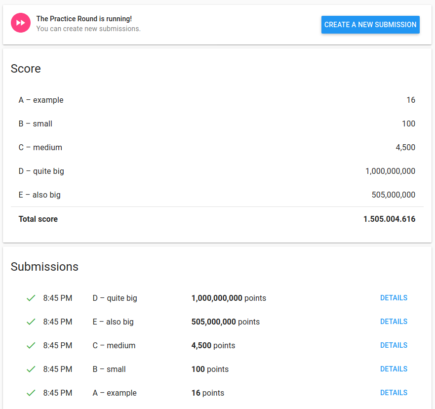

# google-hashcode-2020-pizza-prep
You are organizing a Hash Code hub and want to order pizza for your hub’s participants. Luckily, there is a nearby pizzeria with really good pizza.

To create the outputs just run
``` 
chmod u+x pizza.py
./pizza.py
```

